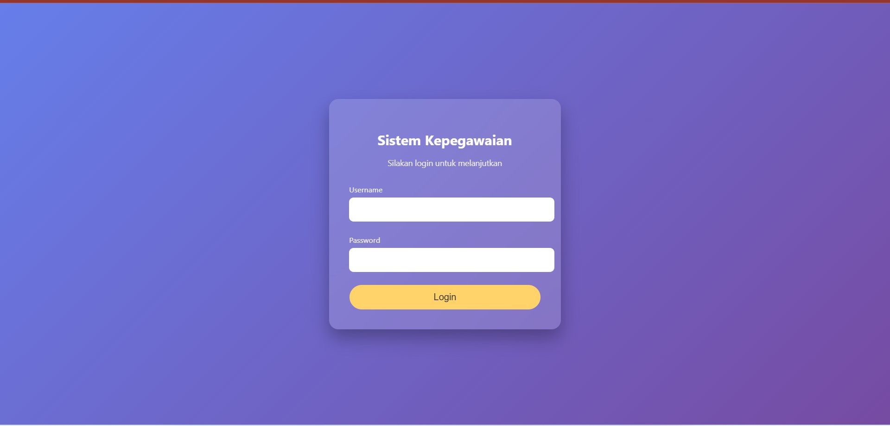
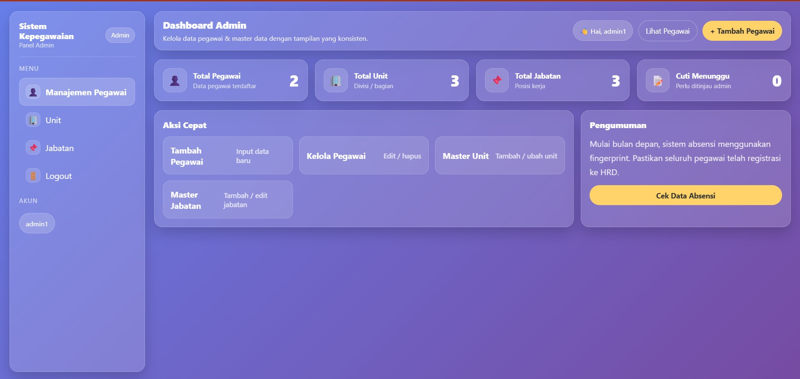
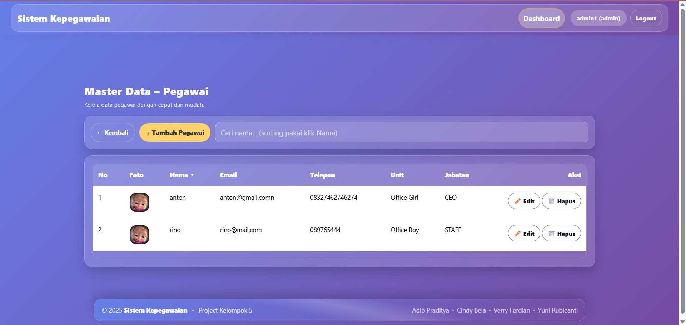
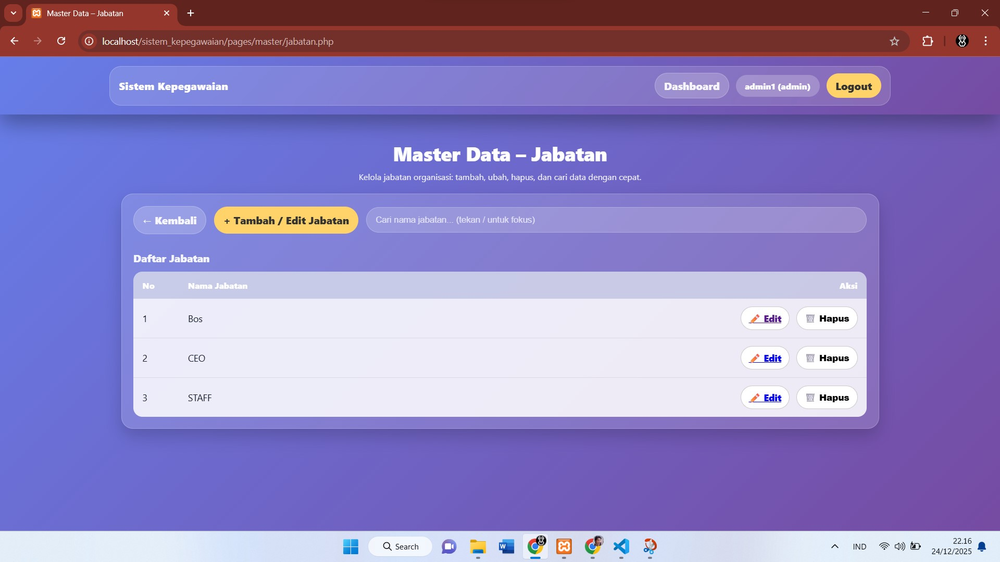

# 🏢 Sistem Kepegawaian Berbasis Web

Sistem Kepegawaian adalah aplikasi berbasis web yang digunakan untuk mengelola data pegawai secara terstruktur dan terkomputerisasi.  
Aplikasi ini membantu admin dalam mengelola data pegawai, jabatan, absensi, serta laporan kepegawaian secara efisien.

Project ini dikembangkan sebagai **Project Kelompok 5**.

---

## 🎯 Tujuan Aplikasi

- Mempermudah pengelolaan data pegawai
- Mengurangi kesalahan pencatatan data manual
- Menyediakan laporan kepegawaian secara cepat dan akurat
- Sebagai media pembelajaran pengembangan aplikasi web berbasis PHP & MySQL

---

## ✨ Fitur Utama

- 🔐 Login & autentikasi pengguna
- 👤 Manajemen data pegawai
- 🧾 Manajemen jabatan & divisi
- ⏱️ Pengelolaan absensi pegawai
- 📊 Laporan data kepegawaian
- 🔎 Pencarian data pegawai
- 🗑️ CRUD data (Create, Read, Update, Delete)

---

## 🛠️ Teknologi yang Digunakan

- **Bahasa Pemrograman**: PHP (Native)
- **Database**: MySQL
- **Frontend**: HTML, CSS, Bootstrap
- **Backend**: PHP
- **Web Server**: Apache (XAMPP)

---

## 📂 Struktur Folder Project

sistem-kepegawaian/
│
├── admin/ # Halaman admin
├── includes/ # Header, footer, dan konfigurasi
├── assets/ # CSS, JS, gambar
├── database/ # File SQL database
├── ss_an/ # Screenshot aplikasi
├── index.php # Halaman utama
├── login.php # Halaman login
└── README.md # Dokumentasi project


---

## 🖼️ Tampilan Aplikasi

### 🔐 Halaman Login


Halaman login digunakan oleh admin untuk mengakses sistem.  
Pengguna harus memasukkan **username** dan **password** yang valid untuk dapat masuk ke dashboard.

---

### 🏠 Dashboard Admin


Dashboard menampilkan ringkasan informasi sistem, seperti:
- Total pegawai
- Total jabatan
- Informasi umum sistem kepegawaian

---

### 👤 Data Pegawai


Halaman ini digunakan untuk:
- Menampilkan daftar pegawai
- Menambah data pegawai baru
- Mengedit dan menghapus data pegawai
- Mencari data pegawai berdasarkan kriteria tertentu

---

### 🧾 Data Jabatan


Berfungsi untuk mengelola jabatan pegawai, meliputi:
- Nama jabatan
- Deskripsi jabatan
- Relasi jabatan dengan pegawai

---

---

## ⚙️ Instalasi & Konfigurasi

1. **Clone repository**
   ```bash
   git clone https://github.com/username/sistem-kepegawaian.git

2. Pindahkan ke folder XAMPP
   cd XAMPP/htdocs/sistem-kepegawaian

3. Import database
    . Buka phpMyAdmin
    . Buat database baru (contoh:sistem_kepegawaian)
    . Import file SQL dari folder database/

4. Konfigurasi database
    Edit file koneksi:    
      $host = "localhost";
      $user = "root";
      $pass = "";
      $db   = "sistem_kepegawaian";

5. Jalankan aplikasi
    http://localhost/sistem-kepegawaian

🔑 Akun Default
Role	  Username	Password
Admin	  admin	    admin

⚠️ Demi keamanan, silakan ubah password setelah login pertama.

👨‍👩‍👧‍👦 Tim Pengembang

Project Kelompok 5
. Adib Praditya
. Cindy Bela
. Verry Ferdian
. Yuni Rubieanti

📌 Catatan Pengembangan

. Project ini masih dapat dikembangkan lebih lanjut
. Cocok digunakan sebagai bahan pembelajaran & tugas kuliah
. Dapat ditambahkan fitur seperti:
. Export laporan (PDF / Excel)
. Hak akses multi-user
. Grafik statistik kepegawaian

📜 Lisensi

Project ini dibuat untuk keperluan akademik dan pembelajaran.